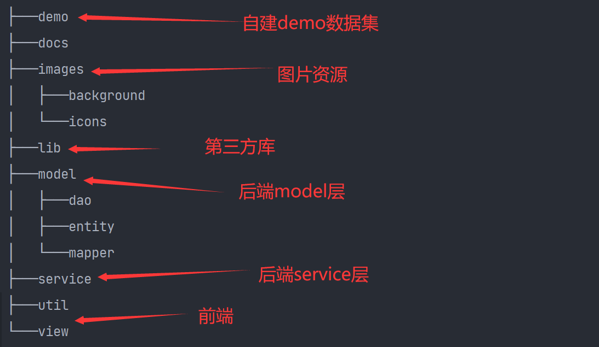
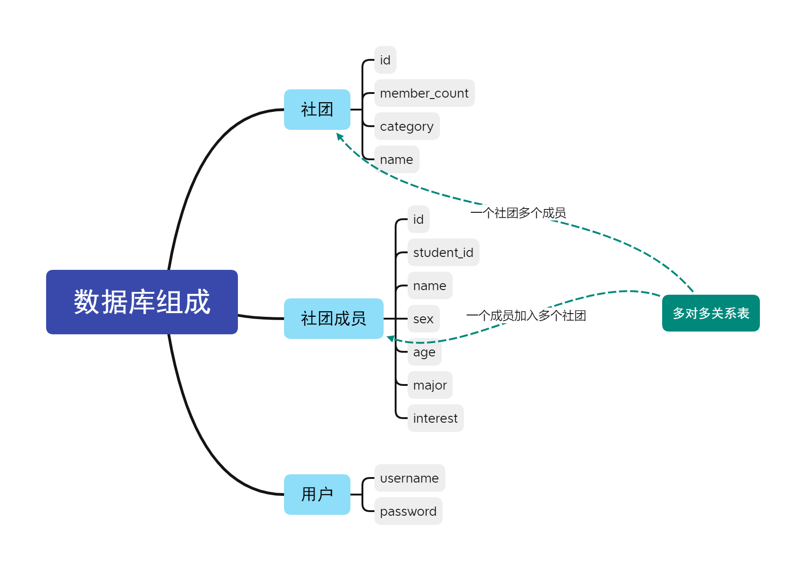
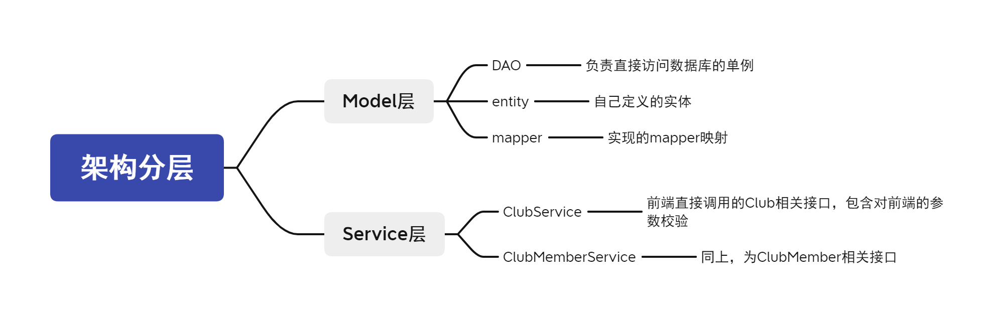
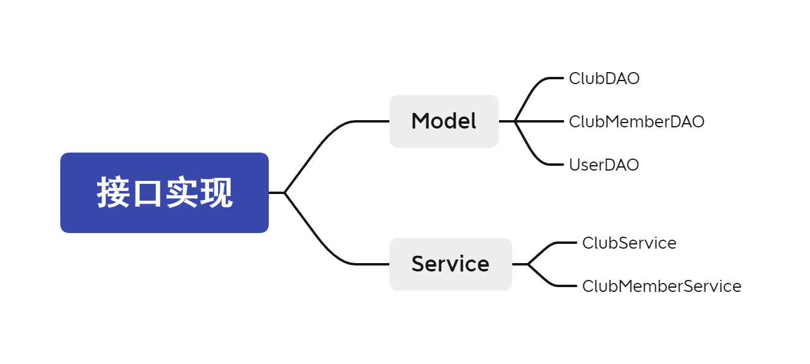
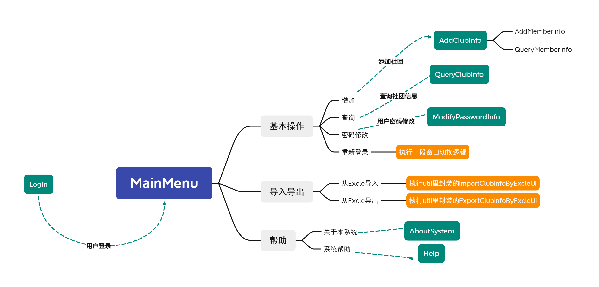

> 本为Java实验课设，为了不浪费时间，故用良好的构思，写出了这个管理系统。

项目仓库地址：[已开源GitHub](https://github.com/ACking-you/StudentClubManager)


## 项目需求

`基本要求：`  

1. 社团管理：具体完成社团的新增、修改、查询等功能；  
2.  人员管理：针对某一指定的社团完成其学员（学生编号、姓名、年龄、所学专业、兴趣爱好等）进行新增、修改、查询、删除等功能；
3.  给定某一学员，查找其所参加的全部社团，并将相关社团信息进行显示输出;  
4. 必须要用面向对象设计思想编程实现

`高级要求：`

1. 界面友好 
2. 实现对社团人数按大小排序的功能；  
3. 在新增学员过程中，实现给定一学生编号，若该学生编号在其他社团中存在，则将该学生的信息自动进行显示，若不存在，则需要录入该学生的所有详细数据信息；  

## 项目实现

本项目采取前后端分离的思想，Swing仅仅负责前端页面的展示，数据由后端访问数据库提供。

代码结构如下：



### 后端实现

#### 数据库设计

一共有四张表：

* users：用于存储用户的账户和密码
* clubs：存储所有社团信息
* club_members：存储每个成员的基本信息
* club_member_relations：存储社团和社团成员的多对多关系



#### 架构分层

> 架构分层如下：
>
> * models：负责直接和数据库打交道初步的增删改查操作。
> * service：真正提供给前端界面的接口，进一步封装增删改查，对上层参数校验，或者将models层零散的数据再包装。



#### 接口实现情况



所有接口如下：

关键设计模式：单例模式。

DAO类均为单例访问模式。

* Club相关

```java
public static void AddClub(Club club) throws RuntimeException;

public static void AddClubList(List<Club> clubList) throws RuntimeException;

public static void UpdateClub(Club club) throws RuntimeException;

public static void DeleteClub(Club club) throws RuntimeException;

public static List<Club> QueryClubsByName(String name) throws RuntimeException;

public static List<Club> QueryClubByMemberId(int memberId) throws RuntimeException;

public static List<Club> QueryAllClub();

    //根据order值返回按memberCount排序的结果：true顺序，false逆序
public static List<Club> QueryAllClubByOrder(boolean order);
```

* ClubMember相关

```java
public static void AddClubMember(int clubId, ClubMember member) throws RuntimeException;

//把一堆人加入到一个社团中
public static void AddClubMemberList(int clubId, List<ClubMember> clubMemberList) throws RuntimeException;

public static void UpdateClubMember(ClubMember member) throws RuntimeException;

public static List<ClubMember> QueryClubMemberByName(int clubId, String name) throws RuntimeException;


public static void DeleteClubMemberById(int clubId, int id) throws RuntimeException;

public static List<ClubMember> QueryClubMembersByClubId(int clubId) throws RuntimeException;
```

### 前端实现

#### 架构分层情况


#### 核心设计

所有的界面均采用单例模式进行操作，这样界面之间的交互就不存在任何问题，想要显示任意一个窗口，只需要如下代码，由于用的是一个单例，则每次获取单例时我们应该把它的状态先调整为0，也就是需要单独写一共reset成员函数来进行调整，具体用法如下：

```java
//此处演示为MainMenu窗口，任意窗口都是通过这种模式进行窗口之间的切换和显示，而不是会产生很多问题的new
MainMenu.getInstance().reset();
```

#### 界面美化设计和特色

1. 用定时器不断切换精美背景图片。
2. 重写JLable实现自定义超链接。
3. Excel导入导出功能。
4. 查询的排序算法，支持按照社团人数升序或者降序排序。
4. 所有操作添加了快捷键。
5. 还有一共看似不起眼，但我认为却非常重要的，那就是代码的健壮性，由于后端的分层逻辑使得数据之间的增删改查稳定性极佳。

#### 最终界面效果


### 项目运行

**项目运行环境**

* JDK版本11，只用到了Java1.8的特性，故只需要JDK版本>=1.8。
* mybatis：版本3.5.7，用于快速实现和数据库和模型之间的映射。
* JUnit：版本4.13.2，用于测试各个模块的功能。
* lombok：用于快速生成getter和setter
* poi：版本3.11，用于导入导出Excel表格

**界面的运行流程**



> 界面中所有对数据的操作，都是直接调用后端接口实现。

### 项目代码仓库

[仓库链接](https://github.com/ACking-you/StudentClubManager)
